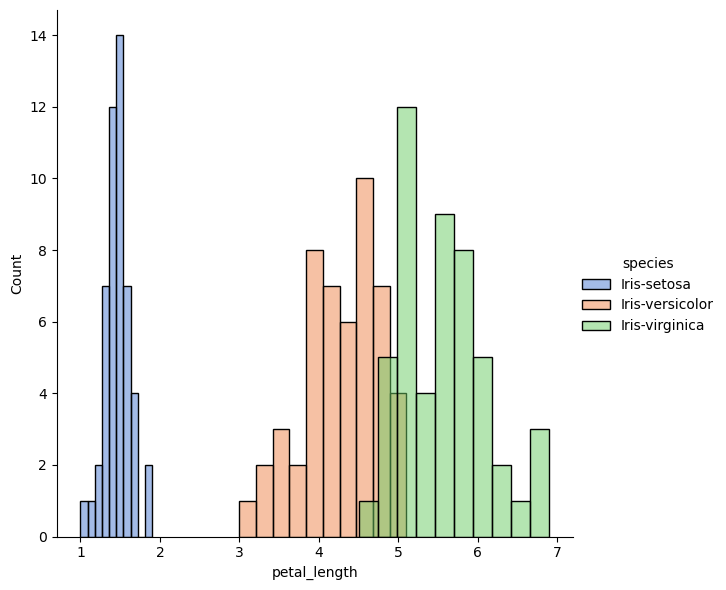
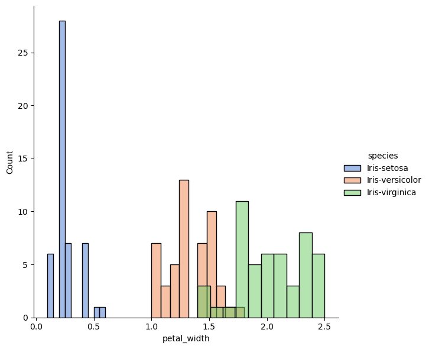
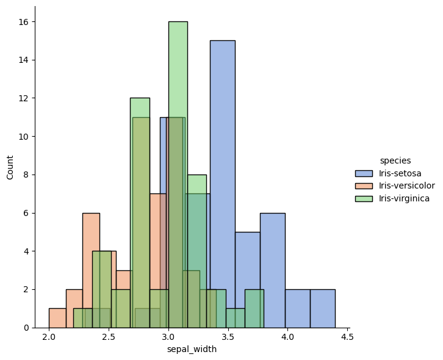
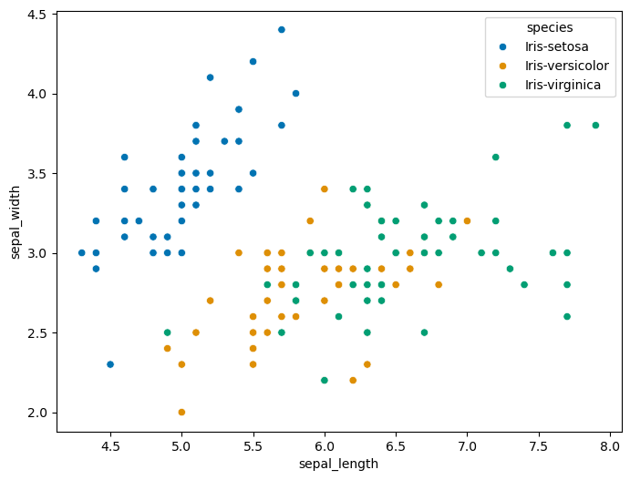

# *Iris* flower data set

> “if we are to learn anything about the ultimate nature of species we must reduce the problem to the simplest terms and study a few easily recognized, well differentiated species”
> 
> — **Edgar Anderson**  
> *The problem of species in the northern blue flags, Iris versicolor L. and Iris virginica L. Annals of the Missouri Botanical Garden, 1928*

This famous dataset, known to be used in R.A. Fisher's classic 1936 paper, *The Use of Multiple Measurements in Taxonomic Problems*, includes three iris species with 50 samples each as well as some properties about each flower.
>
The data set consists of 50 samples from each of three species of Iris (Iris setosa, Iris virginica and Iris versicolor) and has been one of the earliest datasets in Statistis and Computer Science as well as in the literature on classification methods. 
> 
>
## Objective

The purpose of this project will be to extract the data and analyse it by creating a program that:
> 
1. Extracts and organises the different flower types and their categories
2. Summarises each variable to a single text file that one can then use.
3. Saves a histogram of each variable to png files, and outputs a scatter plot of each pair of variables. 
4. Outputs a Pairplot between the different species' variables.
5. Extracts a possible correlation between the various species. 

## Packages needed

- Matplotlib
- Pandas
- Seaborn

## Findings

### Running the Script

Please make sure that all packages are installed and run the script as is. It should provide you with summaries of each feature as well as Pngs of each plot discussed in the analysis below. 
>
Refer to the Jupyter Notebook included for more information on how the code is being run. 

### Summarising the Data

From the summaries we have extracted, we can see that overall, everything falls very much in line with what we expected. With nothing particularly egregious about it but we do notice that some features contain a higher Standard Deviation than others. For instance, petal length has a standard deviation of 1.76, indicating greater spread across the entire dataset. In contrast, sepal width shows much less variation and appears more uniform across species.
>
This is a huge number and already highlights that some species (we're not sure which ones yet, but we could infer Petal Length) are driving that standard deviation up. In other words, there are outliers present in those features that are not shared accross the species and given that number, we can clearly see that some gap between the species is vast.

### Plotting the Data

The plots will highlight our initial findings here and show us if our initial assumptions were correct. Let's have a look at some of them.
>

>
>
From both of these, it seems we were correct in our initial assumptions. We can see that the Petals of the Setosa are all on their side of the plot, separated from the other two. 
Something is happening here that's driving the petals, at least for that species, to be in their own cluster. Interestingly enough, the same doesn't happen for Petal width, which has a lower Standard Deviation than Sepal length but shows no overlap with the other species at all. 
>

>
When it comes to Sepals however, there isn't that much of a correlation and all species seem to share the same characteristics mostly. While we do find some slight variation in the Sepal lenghts (once more, Setosa comes in), when it comes to the Sepal Widths, the graphs being so close to one another is a good reflection of the low standard deviation of that feature.
> 
This brings us then to another way we can analyse this data. Mainly through the use of scatterplots. We can start things off with a pair plot.
> 

>

